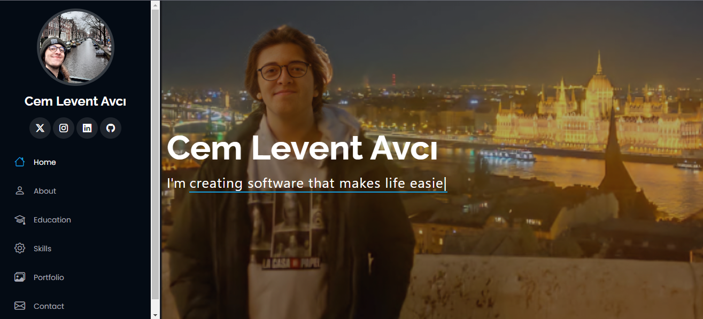
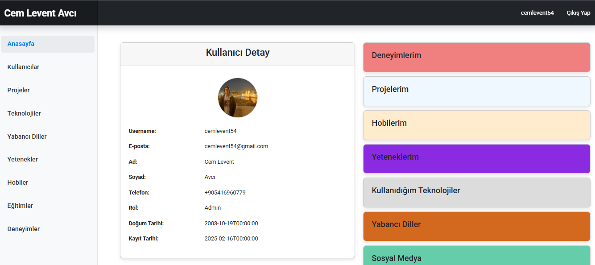

# 🌐 Personal Portfolio Website

Welcome to my personal portfolio website! 🚀 This fully responsive, dynamic, and interactive platform showcases my skills, experiences, and projects. Designed with both aesthetics and functionality in mind, it is built using modern web technologies.



## 🌟 Features

✅ Session-Based Authentication - Secure user authentication using session-based login.

✅ Dynamic Dashboard - Personalized user dashboard with profile details.

✅ Project Showcase - A dedicated section to list, filter, and explore my projects.

✅ Skill & Technology Stack - A comprehensive overview of my expertise and the technologies I use.

✅ Resume Management - Users can update their CV by modifying their cvUrl.

✅ Contact Form - An interactive form to easily get in touch with me.

✅ Admin Panel - Admin users can manage content dynamically.



## 🛠️ Tech Stack

### Frontend

- **Vue.js** : A modern and lightweight JavaScript framework for building dynamic UIs.

- **Bootstrap** : A responsive CSS framework for designing mobile-first, elegant layouts.

### Backend

- **ASP.NET Core Web API** : A secure, high-performance API to handle business logic.

- **SQLite** : A lightweight and efficient database solution for data management.

- **Session-Based Authentication** : Secure session management instead of token-based authentication.

### DevOps

- **Docker** : Containerized deployment for both frontend and backend, ensuring consistency across environments.

## 🚀 Getting Started (Local Setup)

1. Clone the repository

   ```
   git clone https://github.com/cemlevent54/MyPortfolio.git
   cd MyPortfolio
   ```

2. Start Docker Desktop

   Ensure Docker Desktop is running on your system.

3. Build and Run the Project

   Run the following command to build and start the application in detached mode:

   ```
   docker-compose up --build -d
   ```

4. Troubleshooting Backend Issues

   If the backend encounters errors, try running these commands

   ```
   cd ..
   cd api
   dotnet restore
   dotnet build
   dotnet ef database update
   ```

🚀 Now, your portfolio should be up and running!

## 📩 Contact

If you have any questions or inquiries, feel free to reach out via email:

📧 **[cemlevent54@gmail.com](https://mail.google.com/mail/?view=cm&fs=1&to=cemlevent54@gmail.com)**

I'm happy to help! 🚀
